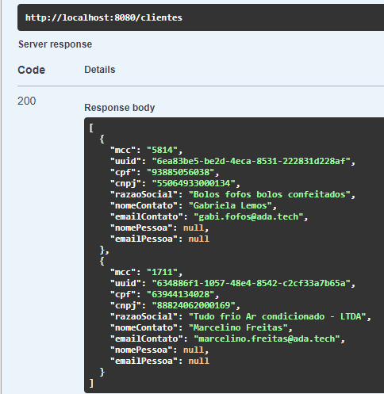

# Desafio Bootcamp Cielo

## Objetivo

Repositório do candidato Marcos Sousa cujo objetivo e mostrar aos avaliadores os desafios solicitados implementados.

* [Aplicação](#aplicação)
* [Desafios](#desafios)
* [Desafio 1](#desafio-1)
* [Desafio 2](#desafio-2)
* [Desafio 3](#desafio-3)
* [Desafio 4](#desafio-4)


## Aplicação

## Desafios

### Desafio 1 
modelar uma API REST com operações que possibilitem a **criação, alteração,
exclusão e consulta** de pré-cadastros de clientes. O entregável deverá ser um
documento **swagger**.


### Desafio 2

a) incluir na API criada no desafio “1” uma nova operação que possibilite a **retirada do
próximo cliente** da fila de atendimento e retorne os dados disponíveis:

Os seguintes endpoints foram criados para esta finalidade;

* `GET /clientes`: retorna a lista de clientes na fila de atendimento.
* `GET /clientes/retirar`: retira o primeiro cliente na fila para atendimento.

Para testar a funcionalidade compartilhamos os seguintes dados para cadastro:

**Pessoa Física**

Cadastre os seguintes dados utilizando o endpoint `POST /clientes/pessoasfisicas`:

```json
{
  "mcc": "0763",
  "cpf": "84122878004",
  "nomePessoa": "Ana Moreira Froes",
  "emailPessoa": "ana.moreira@ada.tech"
}
```

**Pessoa Jurídica**

Cadastre os seguintes dados utilizando o endpoint `POST /clientes/pessoasjuridicas`:

```json
{
  "mcc": "1711",
  "cpf": "63944134028",
  "cnpj": "88824062000169",
  "razaoSocial": "Tudo frio Ar condicionado",
  "nomeContato": "Marcelino Freitas",
  "emailContato": "marcelino.freitas@ada.tech"
}
```

```json
{
  "mcc": "5814",
  "cpf": "93885056038",
  "cnpj": "55064933000134",
  "razaoSocial": "Bolos fofos bolos confeitados",
  "nomeContato": "Gabriela Lemos",
  "emailContato": "gabi.fofos@ada.tech"
}
```

Após realizar o cadastro chame o endpoint `GET /clientes` para visualizar a lista de clientes na fila de atendimento.


#### Simulando uma alteração
Vamos simular uma alteração no cadastro do cliente 2, **Tudo frio Ar condicionado** para colocar este cliente em último na fila.

Vamos utilizar o endpoint `PUT /clientes/pessoasjuridicas`
segue um json com a sugestão de alteração:
```json
{
  "mcc": "1711",
  "cpf": "63944134028",
  "cnpj": "88824062000169",
  "razaoSocial": "Tudo frio Ar condicionado - LTDA",
  "nomeContato": "Marcelino Freitas",
  "emailContato": "marcelino.freitas@ada.tech"
}
```

Após a alteração o cliente aparecerá em último na fila de atendimento.


#### Retirando um cliente para atendimento

Conforme demonstrado pelos passos anteriores. Quando for realizada a chamada ao endpoint `GET /clientes/retirar`. Iremos receber o seguinte cliente da fila:
```json
{
  "mcc": "0763",
  "cpf": "84122878004",
  "nomePessoa": "Ana Moreira Froes",
  "emailPessoa": "ana.moreira@ada.tech"
}
```

Faça a chamada ao endpoint e obtenha a seguinte resposta


Ao chamar novamente o endpoint `GET /clientes` teremos somente dois clientes na fila de atendimento.



### Desafio 3

_Desenhe e implemente uma nova solução para a fila de atendimento, utilizando a
solução de mensageria SQS da AWS._

Implementado junto a aplicação um serviço que se comunica com a Amazon SQS cujo objetivo e gerenciar a fila de atendimento de novos clientes cadastrados no **Prospect clientes**.

Segue abaixo o desenho da arquitetura para o atendimento do desafio.


### Desafio 4

_a) identifique um débito técnico de Segurança da Informação na aplicação;_

_b) detalhe o débito técnico identificado, informando a criticidade e possíveis
consequências;_

_c) planeje as atividades técnicas para o desenvolvimento da solução;_

_d) implemente a solução._
